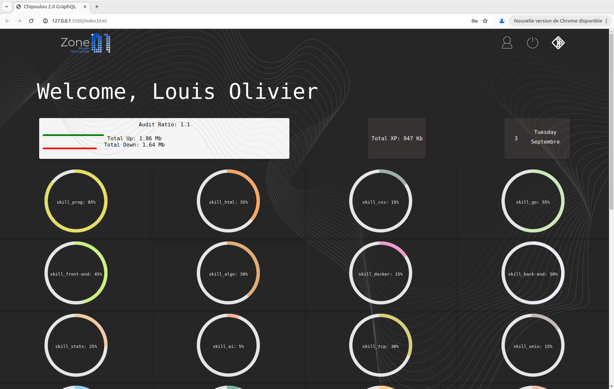

```
 ______
|___  /                                ___    _
   / /    ___    _ __     ___         / _ \  / |
  / /    / _ \  | '_ \   / _ \       | | | | | |
 / /__  | (_) | | | | | |  __/       | |_| | | |
/_____|  \___/  |_| |_|  \___|        \___/  |_|


```

# GraphQL

This project's purpose is to re-create our school's platform using javascript, html and css.


## STEPS

The steps :

    - Go in the index.html file
    - Open a live server (alt + l + o)
    - You have access to the site now
  
## IMAGES FROM MY SITE

**These are the data from September the 3rd of 2024 !**

|| |
|-|-|
|<p style="text-align:center;">The top with the audit ratio and the xp gained</p>|<p style="text-align:center;">The curve of the xp</p>|